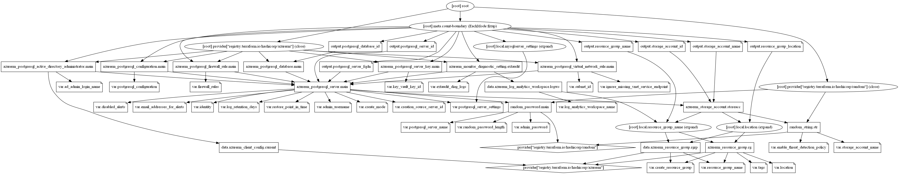

# Azure Database for PostgreSQL Terraform Module

Azure Database for PostgreSQL Single Server is a fully managed database service with minimal requirements for customizations of database. The single server platform is designed to handle most of the database management functions such as patching, backups, high availability, security with minimal user configuration and control. The architecture is optimized for built-in high availability with 99.99% availability on single availability zone. It supports community version of PostgreSQL 9.5, 9,6, 10, and 11.

## Resources are supported

* [PostgreSQL Server](https://registry.terraform.io/providers/hashicorp/azurerm/latest/docs/resources/postgresql_server)
* [PostgreSQL Database](https://registry.terraform.io/providers/hashicorp/azurerm/latest/docs/resources/postgresql_database)
* [PostgreSQL Configuration](https://registry.terraform.io/providers/hashicorp/azurerm/latest/docs/resources/postgresql_configuration)
* [PostgreSQL Firewall Rules](https://registry.terraform.io/providers/hashicorp/azurerm/latest/docs/resources/postgresql_firewall_rule)
* [PostgreSQL Active Directory Administrator](https://registry.terraform.io/providers/hashicorp/azurerm/latest/docs/resources/postgresql_active_directory_administrator)
* [PostgreSQL Customer Managed Key](https://registry.terraform.io/providers/hashicorp/azurerm/latest/docs/resources/postgresql_server_key)
* [PostgreSQL Virtual Network Rule](https://registry.terraform.io/providers/hashicorp/azurerm/latest/docs/resources/postgresql_virtual_network_rule)
* [PostgreSQL Diagnostics](https://docs.microsoft.com/en-us/azure/azure-sql/database/metrics-diagnostic-telemetry-logging-streaming-export-configure?tabs=azure-portal)

```terraform
module "postgresql-db" {
  source  = "kumarvna/postgresql-db/azurerm"
  version = "1.0.0"

  # By default, this module will create a resource group
  # proivde a name to use an existing resource group and set the argument 
  # to `create_resource_group = false` if you want to existing resoruce group. 
  # If you use existing resrouce group location will be the same as existing RG.
  create_resource_group = false
  resource_group_name   = "rg-shared-westeurope-01"
  location              = "westeurope"

  # PostgreSQL Server and Database settings
  postgresql_server_name = "mypostgresdbsrv01"

  postgresql_server_settings = {
    sku_name   = "GP_Gen5_8"
    storage_mb = 640000
    version    = "9.6"
    # default admin user `sqladmin` and can be specified as per the choice here
    # by default random password created by this module. required password can be specified here
    admin_username = "postgresadmin"
    admin_password = "H@Sh1CoR3!"
    # Database name, charset and collection arguments  
    database_name = "demo-postgres-db"
    charset       = "UTF8"
    collation     = "English_United States.1252"
    # Storage Profile and other optional arguments
    auto_grow_enabled                = true
    backup_retention_days            = 7
    geo_redundant_backup_enabled     = true
    public_network_access_enabled    = true
    ssl_enforcement_enabled          = true
    ssl_minimal_tls_version_enforced = "TLS1_2"
  }

  # PostgreSQL Server Parameters 
  # For more information: https://bit.ly/3dbYTtB
  postgresql_configuration = {
    backslash_quote = "on"
  }

  # Use Virtual Network service endpoints and rules for Azure Database for PostgreSQL
  subnet_id = var.subnet_id

  # The URL to a Key Vault custom managed key
  key_vault_key_id = var.key_vault_key_id

  # To enable Azure Defender for database set `enable_threat_detection_policy` to true 
  enable_threat_detection_policy = true
  log_retention_days             = 30
  email_addresses_for_alerts     = ["user@example.com", "firstname.lastname@example.com"]

  # AD administrator for an Azure database for PostgreSQL
  # Allows you to set a user or group as the AD administrator for PostgreSQL server
  ad_admin_login_name = "firstname.lastname@example.com"

  # (Optional) To enable Azure Monitoring for Azure PostgreSQL database
  # (Optional) Specify `storage_account_name` to save monitoring logs to storage. 
  # log_analytics_workspace_name = "loganalytics-we-sharedtest2"

  # Firewall Rules to allow azure and external clients and specific Ip address/ranges. 
  firewall_rules = {
    access-to-azure = {
      start_ip_address = "0.0.0.0"
      end_ip_address   = "0.0.0.0"
    },
    desktop-ip = {
      start_ip_address = "49.204.228.223"
      end_ip_address   = "49.204.228.223"
    }
  }

  # Tags for Azure Resources
  tags = {
    Terraform   = "true"
    Environment = "dev"
    Owner       = "test-user"
  }
}
```

## Default Local Administrator and the Password

This module utilizes __`postgresadmin`__ as a local administrator on PostgreSQL server. If you want to you use custom username, then specify the same by setting up the argument `admin_username` with a valid user string.

By default, this module generates a strong password for PostgreSQL server also allows you to change the length of the random password (currently 24) using the `random_password_length` variable. If you want to set the custom password, specify the argument `admin_password` with a valid string.

## **`postgresql_server_settings`** - Setting up your PostgreSQL Server

This object helps you setup desired PostgreSQL server and support following arguments.

| Argument | Description |
|--|--|
`sku_name`|Specifies the SKU Name for this PostgreSQL  Server. The name of the SKU, follows the tier + family + cores pattern (e.g. `B_Gen4_1`, `GP_Gen5_8`). Valid values are `B_Gen4_1`, `B_Gen4_2`, `B_Gen5_1`, `B_Gen5_2`, `GP_Gen4_2`, `GP_Gen4_4`, `GP_Gen4_8`, `GP_Gen4_16`, `GP_Gen4_32`, `GP_Gen5_2`, `GP_Gen5_4`, `GP_Gen5_8`, `GP_Gen5_16`, `GP_Gen5_32`, `GP_Gen5_64`, `MO_Gen5_2`, `MO_Gen5_4`, `MO_Gen5_8`, `MO_Gen5_16`, `MO_Gen5_32`.
`storage_mb`|Max storage allowed for a server. Possible values are between `5120` MB(5GB) and `1048576` MB(1TB) for the Basic SKU and between `5120` MB(5GB) and `16777216` MB(16TB) for General Purpose/Memory Optimized SKUs.
`version`|Specifies the version of PostgreSQL to use. Valid values are `9.5`, `9.6`, `10`, `10.0`, and `11`.
`database_name`|Specifies the name of the PostgreSQL Database, which needs [to be a valid PostgreSQL identifier](https://www.postgresql.org/docs/current/static/sql-syntax-lexical.html#SQL-SYNTAX-IDENTIFIERS).
`charset`|Specifies the Charset for the PostgreSQL Database, which needs [to be a valid PostgreSQL Charset.](https://www.postgresql.org/docs/current/static/multibyte.html).
`collation`|Specifies the Collation for the PostgreSQL Database, which needs [to be a valid PostgreSQL Collation](https://www.postgresql.org/docs/current/static/collation.html). Note that Microsoft uses different [notation](https://msdn.microsoft.com/library/windows/desktop/dd373814.aspx) - en-US instead of en_US.
`admin_username`|The Administrator Login for the PostgreSQL Server. Required when `create_mode` is `Default`.
`admin_password`|The Password associated with the `admin_username` for the PostgreSQL Server. Required when `create_mode` is `Default`
`auto_grow_enabled`|Enable/Disable auto-growing of the storage. Storage auto-grow prevents your server from running out of storage and becoming read-only. If storage auto grow is enabled, the storage automatically grows without impacting the workload. The default value if not explicitly specified is `true`
`backup_retention_days`|Backup retention days for the server, supported values are between `7` and `35` days.
`geo_redundant_backup_enabled`|Turn Geo-redundant server backups on/off. This allows you to choose between locally redundant or geo-redundant backup storage in the General Purpose and Memory Optimized tiers. When the backups are stored in geo-redundant backup storage, they are not only stored within the region in which your server is hosted, but are also replicated to a paired data center. This provides better protection and ability to restore your server in a different region in the event of a disaster. This is not support for the Basic tier.
`infrastructure_encryption_enabled`|Whether or not infrastructure is encrypted for this server. This property is currently still in development and not supported by Microsoft. If the `infrastructure_encryption_enabled` attribute is set to `true` the postgreSQL instance will incur a substantial performance degradation due to a second encryption pass on top of the existing default encryption that is already provided by Azure Storage. It is strongly suggested to leave this value `false` as not doing so can lead to unclear error messages. Defaults to `false`
`public_network_access_enabled`|Whether or not public network access is allowed for this server. Defaults to `true`.
`ssl_enforcement_enabled`|Specifies if SSL should be enforced on connections. Possible values are `true` and `false`
`ssl_minimal_tls_version_enforced`|The minimum TLS version to support on the sever. Possible values are `TLSEnforcementDisabled`, `TLS1_0`, `TLS1_1`, and `TLS1_2`. Defaults to `TLSEnforcementDisabled`.

## Advanced Usage of the Module

### **`postgresql_configuration`** - Configure PostgreSQL Server Parameters

The PostgreSQL server maintains many system variables that configure its operation. Each system variable has a default value. System variables can be set at server startup using options on the command line or in an option file. Most of them can be changed dynamically at runtime using the SET statement, which enables you to modify operation of the server without having to stop and restart it. You can also use system variable values in expressions.

A few Supported parameters are here for your reference. you can find all these `Server Paramter` section in PostgreSQL server. Also check [PostgreSQL website](https://www.postgresql.org/docs/9.6/config-setting.html) for more details.

| Parameter name | Description | Parameter Type |Default Value
|--|--|--|--|
`connection_throttling`|Enables temporary connection throttling per IP for too many invalid password login failures. Valid values are `ON` and `OFF`|Dynamic|`ON`
`deadlock_timeout`|Sets the amount of time, in milliseconds, to wait on a lock before checking for deadlock. Allowed value should be: 1-2147483647|Dynamic|`1000`
`log_min_error_statement`|Causes all statements generating error at or above this level to be logged.|Dynamic|`ERROR`
`old_snapshot_threshold`|Time before a snapshot is too old to read pages changed after the snapshot was taken. Any change requires server restart.|Static|`-1`

### PostgreSQL Virtual Network Rule

A virtual network rule for your Azure Database for PostgreSQL server is a subnet that is listed in the access control list (ACL) of your Azure Database for PostgreSQL server. To be in the ACL for your Azure Database for PostgreSQL server, the subnet must contain the **`Microsoft.Sql`** type name. To enable this feature, add a `subnet_id` with valid resource id.

>This feature is available in all regions of Azure public cloud where Azure Database for PostgreSQL is deployed for General Purpose and Memory Optimized servers. In case of VNet peering, if traffic is flowing through a common VNet Gateway with service endpoints and is supposed to flow to the peer, please create an ACL/VNet rule to allow Azure Virtual Machines in the Gateway VNet to access the Azure Database for PostgreSQL server.

### Data Encryption with a Customer-managed Key

Data encryption with customer-managed keys for Azure Database for PostgreSQL enables you to bring your own key (BYOK) for data protection at rest. It also allows organizations to implement separation of duties in the management of keys and data.

Data encryption is set at the server-level. The customer-managed key is an asymmetric key stored in a customer-owned and customer-managed Azure `Key Vault` instance. To add you own key from key valut use variable `key_vault_key_id` with valid key URL.

### Server Firewall Rules

Firewalls prevent all access to your database server until you specify which computers have permission. To configure a firewall, create firewall rules that specify ranges of acceptable IP addresses.

By default, no external access to your PostgreSQL Database will be allowed until you explicitly assign permission by creating a firewall rule. To add the firewall rules to the PostgreSQL database, specify the list of `firewall_rules` with valid IP addresses.

### Adding Active Directory Administrator to PostgreSQL Database

Azure Active Directory authentication is a mechanism of connecting to Microsoft Azure database for PostgreSQL by using identities in Azure Active Directory (Azure AD). This module adds the provided Azure Active Directory user/group to PostgreSQL Database as an administrator so that the user can login to this database with Azure AD authentication.

By default, this feature not enabled on this module. To add the Active Directory Administrator, set the argument `ad_admin_login_name` with a valid Azure AD user/group login name.  

### Threat detection policy AKA Server Security Alerts Policy

Advanced Threat Detection for Azure Database for PostgreSQL server detects anomalous activities indicating unusual and potentially harmful attempts to access or exploit databases and it can trigger the following alerts:

* Access from unusual location
* Access from unusual Azure data center
* Access from unfamiliar principal
* Access from a potentially harmful application
* Brute force login credentials

By default, this feature not enabled on this module. Enable threat detection policy setting up the variables `enable_threat_detection_policy`, `log_retention_days` and `email_addresses_for_alerts` with valid values.

>Note: Enabling `threat_detection_policy` features on SQL servers and database going to create a storage account to keep all audit logs by this module. Log retention policy to be configured to keep the size within limits for this storage account. Note that this module creates resources that can cost money.

## Recommended naming and tagging conventions

Applying tags to your Azure resources, resource groups, and subscriptions to logically organize them into a taxonomy. Each tag consists of a name and a value pair. For example, you can apply the name `Environment` and the value `Production` to all the resources in production.
For recommendations on how to implement a tagging strategy, see Resource naming and tagging decision guide.

>**Important** :
Tag names are case-insensitive for operations. A tag with a tag name, regardless of the casing, is updated or retrieved. However, the resource provider might keep the casing you provide for the tag name. You'll see that casing in cost reports. **Tag values are case-sensitive.**

An effective naming convention assembles resource names by using important resource information as parts of a resource's name. For example, using these [recommended naming conventions](https://docs.microsoft.com/en-us/azure/cloud-adoption-framework/ready/azure-best-practices/naming-and-tagging#example-names), a public IP resource for a production SharePoint workload is named like this: `pip-sharepoint-prod-westus-001`.

## Requirements

| Name | Version |
|------|---------|
| terraform | >= 0.13 |
| azurerm | >= 2.59.0 |

## Providers

| Name | Version |
|------|---------|
| azurerm | >= 2.59.0 |
| random |>= 3.1.0 |

## Inputs

| Name | Description | Type | Default |
|--|--|--|--|
`create_resource_group` | Whether to create resource group and use it for all networking resources | string | `"false"`
`resource_group_name` | The name of the resource group in which resources are created | string | `""`
`location` | The location of the resource group in which resources are created | string | `""`
`log_analytics_workspace_name`|The name of log analytics workspace name|string|`null`
`random_password_length`|The desired length of random password created by this module|string|`24`
`subnet_id`|The resource ID of the subnet|string|`null`
`postgresql_server_name`|PostgreSQL server Name|string|`""`
`admin_username`|The username of the local administrator used for the SQL Server|string|`"postgresadmin"`
`admin_password`|The Password which should be used for the local-administrator on this SQL Server|string|`null`
`identity`|If you want your SQL Server to have an managed identity. Defaults to false|string|`false`
`postgresql_server_settings`|PostgreSQL server settings|object({})|`{}`
`create_mode`|The creation mode. Can be used to restore or replicate existing servers. Possible values are `Default`, `Replica`, `GeoRestore`, and `PointInTimeRestore`|string|`Default`
`creation_source_server_id`|For creation modes other than `Default`, the source server ID to use|string|`null`
`restore_point_in_time`|When `create_mode` is `PointInTimeRestore`, specifies the point in time to restore from `creation_source_server_id`|string|`null`
`storage_account_name`|The name of the storage account name|string|`null`
`enable_threat_detection_policy`|Threat detection policy configuration, known in the API as Server Security Alerts Policy|string|`false`
`email_addresses_for_alerts`|Account administrators email for alerts|`list(any)`|`""`
`disabled_alerts`|Specifies a list of alerts which should be disabled. Possible values include `Access_Anomaly`, `Sql_Injection` and `Sql_Injection_Vulnerability`|list(any)|`[]`
`log_retention_days`|Specifies the number of days to keep in the Threat Detection audit logs|number|`30`
`postgresql_configuration`|Sets a PostgreSQL Configuration value on a PostgreSQL Server|map(string)|`{}`
firewall_rules|Range of IP addresses to allow firewall connections|map(object({}))|`null`
`ad_admin_login_name`|The login name of the principal to set as the server administrator|string|`null`
`key_vault_key_id`|The URL to a Key Vault custom managed key|string|`null`
`extaudit_diag_logs`|Database Monitoring Category details for Azure Diagnostic setting|list(string)|`["PostgreSQLLogs", "QueryStoreRuntimeStatistics", "QueryStoreWaitStatistics"]`
`Tags` | A map of tags to add to all resources | map | `{}`

## Outputs

| Name | Description |
|--|--|
`resource_group_name`|The name of the resource group in which resources are created
`resource_group_location`|The location of the resource group in which resources are created
`storage_account_id`|The resource ID of the storage account
`storage_account_name`|The name of the storage account
`postgresql_server_id`|The resource ID of the PostgreSQL Server
`postgresql_server_fqdn`|The FQDN of the PostgreSQL Server
`postgresql_database_id`|The ID of the PostgreSQL Database

## Resource Graph



## Authors

Originally created by [Kumaraswamy Vithanala](mailto:kumarvna@gmail.com)

## Other resources

* [Azure database for PostgreSQL](https://docs.microsoft.com/en-us/azure/postgresql/)
* [Terraform AzureRM Provider Documentation](https://www.terraform.io/docs/providers/azurerm/index.html)
